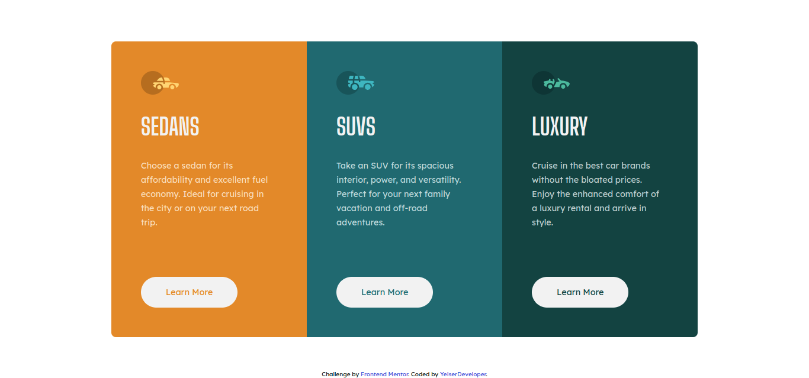

# 3-column preview card component solution

Esta es una solución al [desafío del componente de tarjeta de vista previa de 3 columnas en Frontend Mentor](https://www.frontendmentor.io/challenges/3column-preview-card-component-pH92eAR2-). Los desafíos de Frontend Mentor lo ayudan a mejorar sus habilidades de codificación mediante la creación de proyectos realistas.

## Reto

Los usuarios deben ser capaces de:

- Ver el diseño óptimo según el tamaño de pantalla de su dispositivo.

- Ver estados de desplazamiento para elementos interactivos.

### Screenshot

### Links

- Github: [3-column preview card component](https://github.com/YeiserDeveloper/3-column-preview-card-component-main)
- Live site: [3-column preview card component](https://sparkling-move.surge.sh/)

## Autor

- Frontend Mentor - [@YeiserDeveloper](https://www.frontendmentor.io/profile/YeiserDeveloper)

- Twitter - [@YeiserJiménez2](https://twitter.com/YeiserJimnez2)

- Instagram - [@yeisel_heriel](https://www.instagram.com/yeisel_heriel/)

- Github - [YeiserDeveloper](https://github.com/yeiserdeveloper)